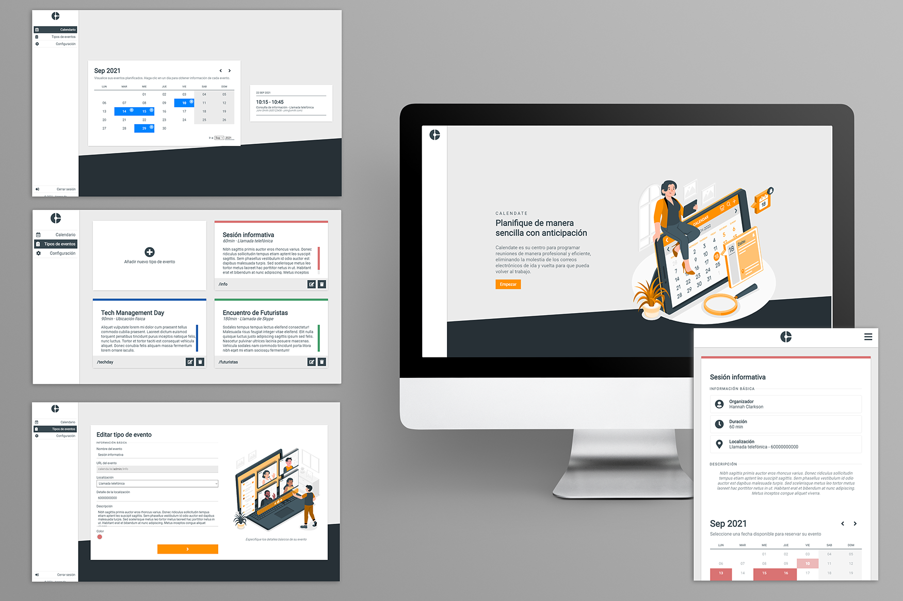

# Calendate (WIP)

_Spring Boot App  - Web application for event management_

Please note that because Heroku is a free Cloud Application Platform, load times can be somewhat high and have nothing to do with the application itself.

Calendate is a web application based on Spring Boot and Thymeleaf that makes event management easier. 

## Features
* Registered users will be able to create types of events that can be booked with them by specifying the following information:
    * Name of the event
    * URL of the link to be generated so that attendees can make their reservation
    * Location: physical location, phone call or Skype call
    * Location details: physical address, phone number or Skype user
    * Description of the event
    * Main color in which the booking page will appear
    * Event duration in minutes
    * Start and end date between which the event can be booked
    * Availability of hours for each day of the week in which the event can be booked
        * If no start or end time is specified, it is assumed that that day cannot be reserved
        * If no start time is specified, it is assumed that the event can be booked that day from 00:00 until the specified end time.
        * If no end time is specified, it is assumed that the event can be booked that day from the specified start time until 23:59.
    * Email notification settings. The following options are allowed to be enabled:
        * Sending confirmation email: send a confirmation email to the attendees once the event is booked.
        * Sending notification email: send a reminder email to the attendees and the organizer one hour before the event.
* Email notifications are sent in two cases:
    * Booking a new event:
        * An email will always be sent to the organizer to notify the details of a new reservation.
        * If the event has the confirmation option enabled, a confirmation email will also be sent to the user who made the reservation.
    * An event that is about to occur:
        * If the event has the reminder option enabled, an email will be sent to both the organizer and the attendee with the information of the event that is close to starting.
* Both registered and non-registered users can reserve an event through the path ”/{username}/{url}” in which they can select the day and time they prefer within the availability of the organizer. Subsequently, they must leave their name, email and phone number so that the organizer can contact them for the event.
* Registered users can easily view the events they have reserved through the calendar available on the main page.

## Technical aspects
### Frontend
* Responsive design. No additional libraries are used as they are considered unnecessary in a simple design that can be achieved with CSS flex and grid.
* Dark theme for users who specify it in their browser settings. It is checked through the guideline: @media (prefers-color-scheme: dark)
* Use of CSS variables, animations and transitions to bring the design to life and make it more professional.
* Use of JS Vanilla for the behavior of alerts, menus, calendars and multi-page forms. 

### Backend
* Use of Spring Boot. The initial project was generated with Spring Initializr with the following modules:
    * Spring Boot Web
    * Spring Boot Security
    * Spring Boot Mail
    * Spring Boot Data JPA + JDBC
    * Spring Boot Validation
    * Spring Boot Devtools
    * Spring Boot Thymeleaf
* Currently there is the possibility of user login and registration in which all act with the same "USER" role, which allows them to create events and view the reserved events.
* Anonymous users can book an event without the need to register.
* The application has the internationalization of all its messages, making it possible to view it in both English and Spanish and each user being able to configure their preferred language.
* To send reminder emails, a scheduled task is established every hour that consults the upcoming events to occur in the next hour and the email is sent to both the organizer and the attendee.
* The mailing is set within an asynchronous method so as not to influence the normal flow of the page. 
* Although initially the application was designed to use MySQL as a database, with the deployment in Heroku it was necessary to migrate to PostgreSQL.
* Currently no distinction is made between different time zones, so UTC is used.
